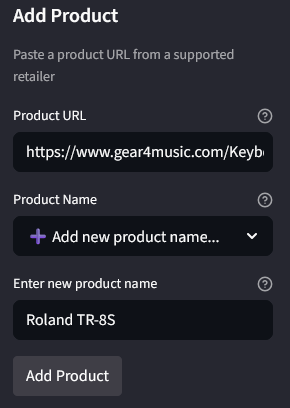
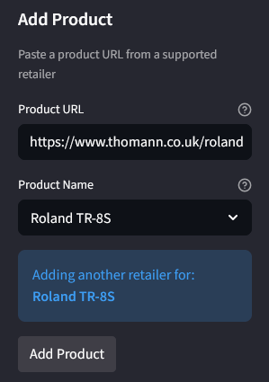
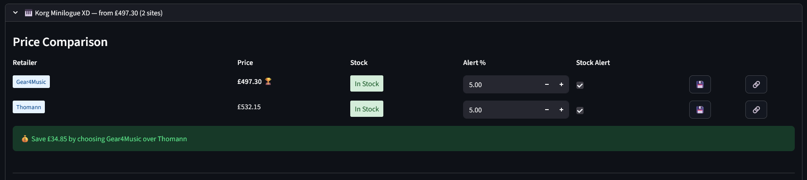
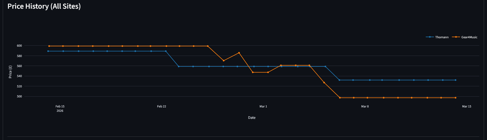
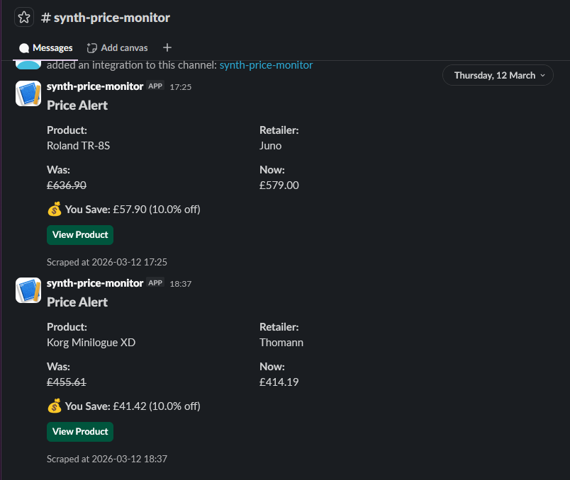
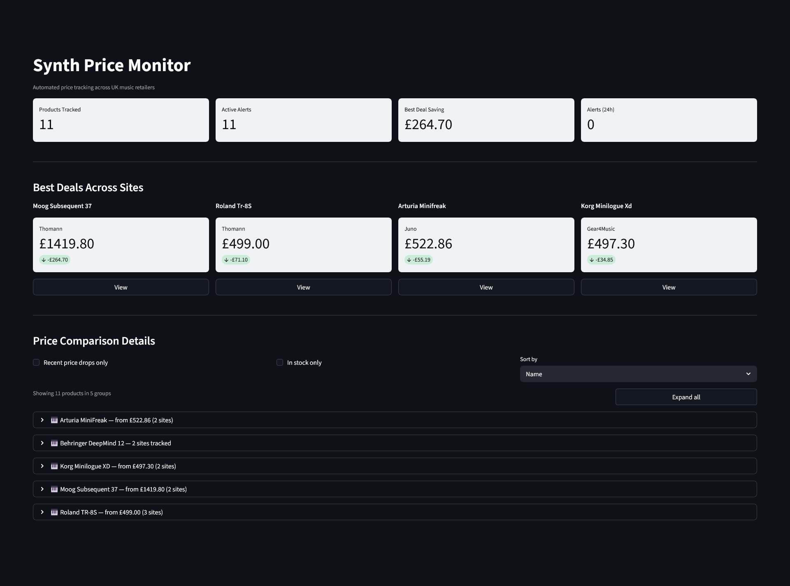
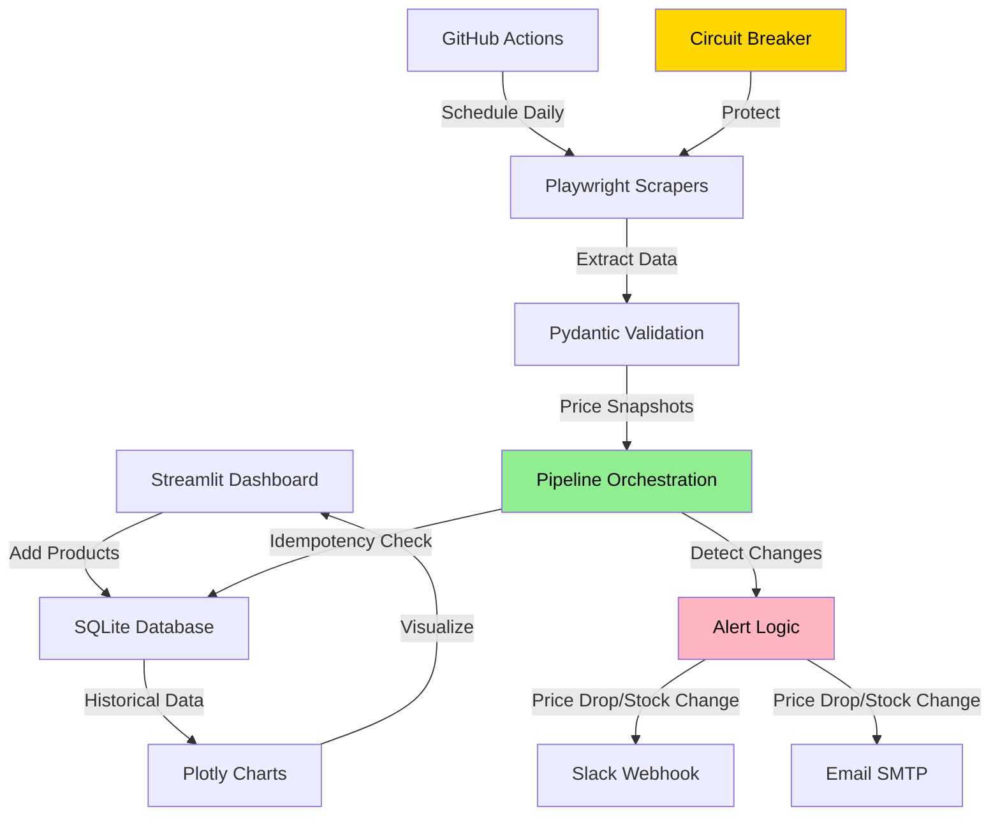

# Synth Price Monitor

[](https://github.com/ancodia/synth-price-monitor/actions/workflows/unit-tests.yml)
[](https://github.com/ancodia/synth-price-monitor/actions/workflows/integration-tests.yml)
[](https://github.com/ancodia/synth-price-monitor/actions/workflows/e2e-tests.yml)
[](https://ancodia.github.io/synth-price-monitor/)
[](https://opensource.org/licenses/MIT)

Retailers don't tell you when prices drop. This system watches them for you — tracking UK synthesizer prices across multiple sites and alerting you the moment a deal appears, with the engineering to run reliably without babysitting.

Most portfolio scrapers fetch a page, parse some HTML, and dump it to a CSV. This project demonstrates what separates a script from a production system.

---

## Engineering Decisions Worth Noting

**Resilience** — Circuit breaker pattern automatically skips failing sites for 1 hour after 3 consecutive failures. Exponential backoff retries (3 attempts) handle transient issues. Single product failures don't crash the pipeline.

**Data integrity** — Pydantic validation at every boundary. Idempotency protection prevents duplicate snapshots when data hasn't changed. Soft delete preserves price history for reactivation.

**Smart alerting** — Threshold-based notifications (configurable per product per retailer) with 24-hour cooldown to prevent spam. Alerts fire on meaningful price drops and back-in-stock events only.

**Observability** — Structured logging with product_id, site, and timing on every scrape. Dual output: stdout for CI, rotating file logs with 30-day retention for debugging.

**Built to be extended** — Adding a new retailer takes one class and one dict entry. No changes needed to the pipeline, database, dashboard, or alert logic.

**Verified correctness** — Three-layer test suite: pure unit tests, integration tests with mock Slack/SMTP servers, and Playwright UI tests against a live Streamlit instance. Results published to GitHub Pages on every push.

---

## Dashboard

### Adding Products

| Add new retailer and product group | Add new retailer to existing product group |
|---|---|
|  |  |

Products from different retailers are grouped under a shared custom name for comparison. The left screenshot shows adding a new product group; the right shows adding a second retailer to an existing one.

### Multi-site product comparison



Products tracked on multiple retailers get a comparison table with the best price highlighted, inline alert configuration, and direct links to each product page.

### Combined price history



All retailers overlaid on a single chart — see pricing patterns at a glance rather than switching between individual views.

### Slack alerts



Rich Block Kit messages with product name, retailer, price change, savings calculation, and a direct link to buy.

### Dashboard overview



Track products, configure alerts per retailer, and see best deals across sites — all from a single Streamlit interface.

---

## Architecture



Pipeline flow per product: **scrape → validate → compare → alert → store**. Each step is isolated — a failure at any point is caught, logged, and doesn't propagate.

---

## Quick Start

### Prerequisites

Docker & Docker Compose, Git, and optionally a Slack workspace for notifications.

### Run locally

```bash
git clone https://github.com/ancodia/synth-price-monitor.git
cd synth-price-monitor

cp .env.example .env          # Edit with your SMTP/Slack credentials

uv sync                        # Install dependencies
uv run python scripts/generate_sample_data.py   # Optional: demo data

docker-compose up dashboard    # Start at http://localhost:8501
```

### Without Docker

```bash
uv sync
uv run playwright install chromium
uv run streamlit run dashboard/app.py
```

### Manual scrape

```bash
docker-compose --profile manual run --rm scraper
```

---

## How It Works

### Adding and grouping products

The dashboard uses manual naming with autocomplete for reliable product grouping. Paste a URL, select an existing product name or create a new one, and the system handles the rest. Products with the same name are automatically grouped for cross-site comparison.

This is a deliberate design choice — automatic name normalization was tested but proved unreliable across diverse retailer naming conventions. Manual naming with autocomplete is more reliable, more flexible, and transparent.

### Alert pipeline

When the scraper runs (daily via GitHub Actions or on-demand), each product goes through the full pipeline. The alert decision logic checks whether a price drop exceeds the configured threshold, whether a product came back in stock, and whether the 24-hour cooldown has elapsed. If all conditions are met, notifications go to Slack and email — both optional, missing credentials skip gracefully rather than crashing.

### Resilience patterns

The circuit breaker tracks consecutive failures per site. After 3 failures, the circuit opens and all requests to that site are skipped for 1 hour — preventing wasted time and rate limit issues when a site is down. Success resets the counter.

Idempotency protection in the database layer prevents duplicate snapshots when price and stock haven't changed between scrapes. This keeps the database clean and charts meaningful.

---

## Testing

Three-layer test suite with a separate CI job for each layer. Results publish to [GitHub Pages](https://ancodia.github.io/synth-price-monitor/) on every push to main.

**Unit tests** (~1 min, no browser, no network) — pure function tests for price parsing, database idempotency, circuit breaker state machine, and alert decision logic. No fixtures, no database, no mock servers.

```bash
uv run pytest tests/unit/ -v
```

**Integration tests** (~1 min, mock Slack/SMTP) — mock servers capture real HTTP/SMTP traffic. Tests verify the full notification flow: payload formatting, content validation, and the end-to-end path from `should_alert()` to delivered message.

```bash
uv run pytest tests/integration/ -v
```

**E2E tests** (~2 min, Playwright) — drives a live Streamlit instance seeded with 14 days of price history across 3 retailers plus a Thomann price drop. Tests verify product grouping, comparison table rendering, chart traces, alert controls, and the best deals section.

```bash
uv run playwright install --with-deps chromium
uv run pytest tests/e2e/ -v --timeout=120
```

---

## Configuration

### Environment variables

Copy `.env.example` to `.env`:

```bash
# Email (Gmail — use an App Password)
SMTP_HOST=smtp.gmail.com
SMTP_PORT=465
SMTP_USER=your-email@gmail.com
SMTP_PASSWORD=your-app-specific-password
EMAIL_FROM=your-email@gmail.com
EMAIL_TO=recipient@example.com

# Slack (optional)
SLACK_WEBHOOK_URL=https://hooks.slack.com/services/YOUR/WEBHOOK/URL
```

Both notification channels are optional. Missing credentials produce a log warning, not a crash.

---

## Design Decisions

**SQLite + Git scraping pattern** — Price history is stored in SQLite and committed via GitHub Actions. Zero infrastructure cost, easy inspection via Git history, built-in backup. Not suitable for >1,000 products or sub-hourly scraping — production alternative would be PostgreSQL or DynamoDB. This pattern is intentional for the use case.

**Soft delete** — Products are marked inactive rather than removed. Re-adding the same URL reactivates the product with all historical snapshots intact. Prevents UNIQUE constraint issues and enables undo.

**Combined vs individual charts** — Multi-site products get a single chart with all retailers overlaid for easy visual comparison. Single-site products get an individual chart with alert settings in a sidebar. The layout adapts automatically based on how many retailers are tracking the product.

---

## Tech Stack

Python 3.11, Playwright (with stealth), Pydantic v2, SQLite, Streamlit, Plotly, Slack webhooks, SMTP, GitHub Actions, Docker, loguru, tenacity. Test infrastructure: pytest, pytest-playwright, aiosmtpd.

---

## What This Could Grow Into

The foundation is deliberately extensible. Near-term additions that would take hours rather than weeks: used/B-stock tracking, FastAPI endpoint for external integrations, multi-currency support (EUR/USD), Telegram bot notifications, and price prediction from historical trends.

---

## License

MIT
